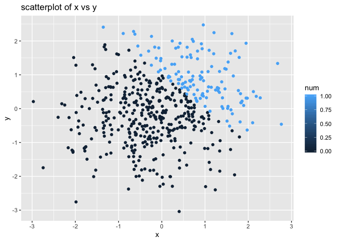
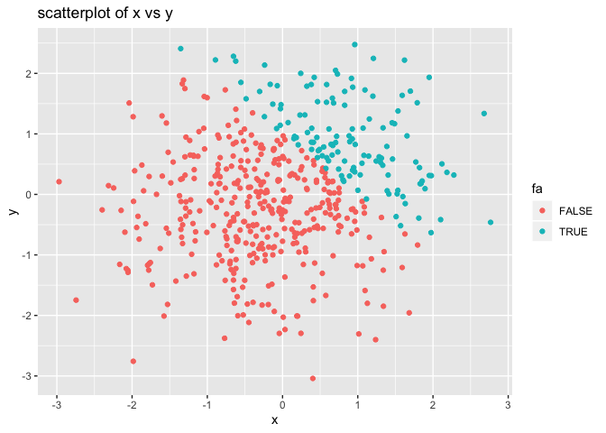

p8105\_hw1\_ss5929
================
ss5929
9/19/2019

\#problem1
    \#\#part1

``` r
library(tidyverse)
```

    ## ─ Attaching packages ───────────────────────────────────── tidyverse 1.2.1 ─

    ## ✔ ggplot2 3.2.1     ✔ purrr   0.3.2
    ## ✔ tibble  2.1.3     ✔ dplyr   0.8.3
    ## ✔ tidyr   1.0.0     ✔ stringr 1.4.0
    ## ✔ readr   1.3.1     ✔ forcats 0.4.0

    ## ─ Conflicts ─────────────────────────────────────── tidyverse_conflicts() ─
    ## ✖ dplyr::filter() masks stats::filter()
    ## ✖ dplyr::lag()    masks stats::lag()

``` r
library(ggplot2)

# create a dataframe
samp        <- rnorm(8)
logical_greater_th_0 <- c(samp>0)
chara_vec   <- c("a","b","Z","d","e","f","g","!")
taste_vec   <- factor(c("bad","bad","good","amazing","good","bad","good","amazing"),
                      c("bad","good","amazing"),
                      ordered =  TRUE)
data_f      <- tibble(samp,logical_greater_th_0,chara_vec,taste_vec)

# take the mean of each variable and the character and logical variable do not work 
mean(samp)
```

    ## [1] -0.5797784

``` r
mean(logical_greater_th_0)
```

    ## [1] 0.125

``` r
mean(chara_vec) 
```

    ## Warning in mean.default(chara_vec): argument is not numeric or logical:
    ## returning NA

    ## [1] NA

``` r
mean(taste_vec) 
```

    ## Warning in mean.default(taste_vec): argument is not numeric or logical:
    ## returning NA

    ## [1] NA

\#\#part2

``` r
as.numeric(pull(data_f,logical_greater_th_0))
```

    ## [1] 0 0 0 1 0 0 0 0

``` r
as.numeric(pull(data_f,chara_vec))
```

    ## Warning: 强制改变过程中产生了NA

    ## [1] NA NA NA NA NA NA NA NA

``` r
as.numeric(pull(data_f,taste_vec))
```

    ## [1] 1 1 2 3 2 1 2 3

\#\#part3

``` r
#convert the logical vector to numeric
logical_c_nu     <- as.numeric(logical_greater_th_0)
logical_c_nu*samp
```

    ## [1] 0.0000000 0.0000000 0.0000000 0.2739276 0.0000000 0.0000000 0.0000000
    ## [8] 0.0000000

``` r
#convert the logical vector to a factor
logical_c_fa     <- as.factor(logical_greater_th_0)
logical_c_fa*samp #the (*) does not work
```

    ## Warning in Ops.factor(logical_c_fa, samp): '*' not meaningful for factors

    ## [1] NA NA NA NA NA NA NA NA

``` r
#convert the factor to numeric
logical_c_re     <- as.numeric(logical_c_fa)
logical_c_re*samp
```

    ## [1] -0.12493348 -1.28991212 -1.53416406  0.54785525 -0.55734657 -0.82971390
    ## [7] -0.49438421 -0.08170061

\#problem2

``` r
# create the dataframe
x   <- rnorm(500)
y   <- rnorm(500)
lo  <- c(x+y>1)
num <- as.numeric(lo)
fa  <- as.factor(lo)
df  <- data.frame(x,y,lo,num,fa)

# description of vector
ncol(df)
```

    ## [1] 5

``` r
nrow(df)
```

    ## [1] 500

``` r
mean(x)
```

    ## [1] -0.04675154

``` r
median(x)
```

    ## [1] -0.05934974

``` r
sd(x)
```

    ## [1] 0.9836185

``` r
# scatterplot
first_plot<-ggplot(data=df,aes(x=x,y=y,color=lo)) + geom_point()+labs(title = "scatterplot of x vs y",x="x",y="y")
            ggplot(data=df,aes(x=x,y=y,color=num))+ geom_point()+labs(title = "scatterplot of x vs y",x="x",y="y")
```

<!-- -->

``` r
            ggplot(data=df,aes(x=x,y=y,color=fa)) + geom_point()+labs(title = "scatterplot of x vs y",x="x",y="y")
```

<!-- -->

``` r
#ggsave
ggsave("scatterplot of first plot in hw1.pdf",plot = first_plot )
```

    ## Saving 7 x 5 in image
